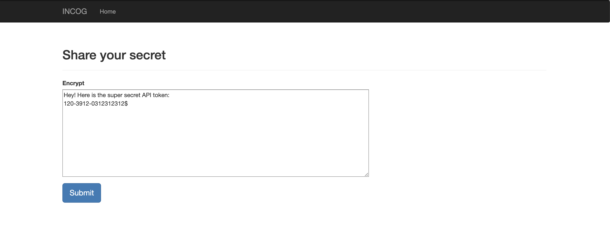
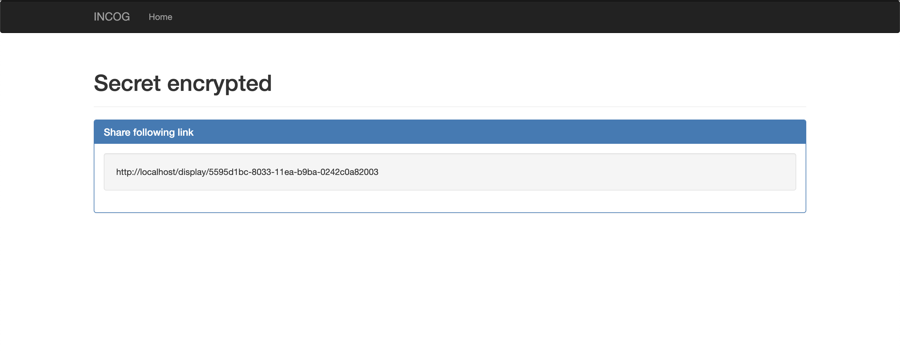
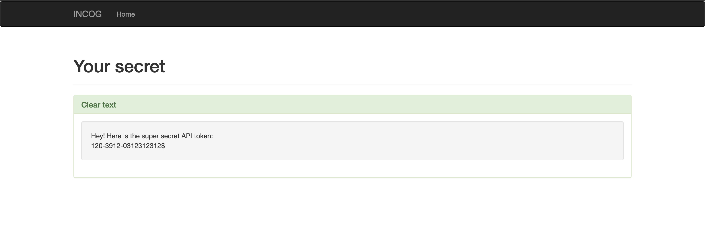
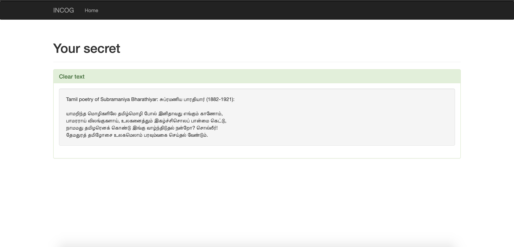
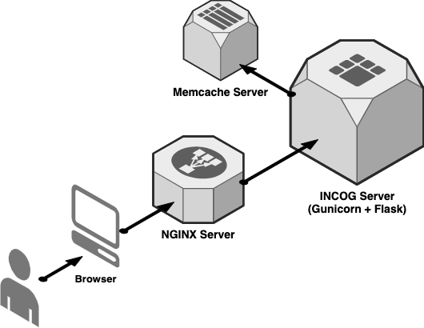

# INCOG - Share secrets securely

Even though sharing secrets is not recommended this is not always possible, especially in rapidly growing engineering teams where velocity takes precedence over security. *INCOG* is designed for teams (engineering and non-engineering) to share secrets like generic passwords, app tokens, API keys, etc. over an end-to-end encrypted channel. This avoids sharing secrets over 3rd-party and insecure channels such as e-mail, slack, messengers, sticky notes (not kidding people do this), etc.

## What is it?

* End-to-end encrypted channel for secret sharing.
* Runs on Docker and is highly scalable.
* Uses AWS KMS for secret key generation i.e. you host & own the master key.
* Every secret shared is encrypted using a unique Data Encryption Key (DEK) with `AES-128-CBC`.
* Secrets storage is ephemeral and not persisted for more than 24hours (which is configurable).
* Neither of encrypting or decrypting a secret is attributed to an user keeping any activity on INCOG anonymized.
* Generates unique/random HTTP URL(s) for sharing secrets, hence can be shared via any channel (email, Slack, etc.)
* Accessible via any browser of your choice. 

#### 3-Easy steps for a secret to be shared:

##### 1. Enter your secret you would like to share

##### 2. Share the randomly generated URL with whomsoever you want

##### 3. Accessing the shared secret

##### INCOG supports unicode

## Installation

INCOG is designed to run on Docker and can be deployed via `docker-compose`. 

*Prerequisites*:
* You have an AWS account and an access Key Management Service (via IAM AccessKey or EC2 Role).
* Docker installed on host machine where INCOG would be installed.
* A TLS certificate (internally signed or Let's Encrypt or other CAs) registered to a domain you would serve INCOG over. Since, TLS is a must and if you don't have means to get one there is a script provided: `deploy/create-local-cert.sh` which can generate a self-signed certificate.
* It is strongly recommended that you serve this app only within an internal network or via a VPN and not directly over the internet.

*Instructions*:
* Generate a Symmetric key on KMS with spec: `SYMMETRIC_DEFAULT` and required policy to access it can be found under `doc/kms-policy.json`
* Clone or download this repo on your host machine where you would like to setup INCOG.
* Configure required values under `deploy/config/incog.env` 
	* *REQUIRED*: `KMS_KEY_ID` - ID of you KMS key.
	* *REQUIRED*: `AWS_DEFAULT_REGION` this should be the same region as of the KMS Key.
	* *OPTIONAL*: `AWS_ACCESS_KEY_ID`, `AWS_SECRET_ACCESS_KEY` set AccessKey of IAM user if you can't set an EC2 IAM role which is the preferred method 
	* *OPTIONAL*: `MEMCACHE_HOST`,`MEMCACHE_PORT` - if you're using your custom Memcache server.
	* *OPTIONAL*: `MEMCACHE_SECRET_LIFESPAN` - if you want to change the default secret lifespan of 24hours.
	* *RECOMMENDED*: `FLASK_SECRET_KEY` - Random string used by flask to sign session. To generate a Random string - `python -c 'import os; print(os.urandom(16))'`
* Configure required values under `deploy/config/incog-nginx.env`
	* *REQUIRED*: `INCOG_HOST` - Name of the domain you want to serve INCOG via. (Don't include http/https)
* Import your TLS certificate and key under `deploy` folder and name it as `incog.cert` & `incog.key` respectively.
* Start INCOG - `cd deploy && docker-compose up -d --build` and verify if all 3 processes (frontend, incog, memcache) are up via `docker ps`.
* You can now start using INCOG via: `https://<INCOG_HOST>` on your favorite browser.

##### To stop INCOG:

Run - `cd deploy && docker-compose down`

## Specifications

INCOG uses the following tech stack:
* Frontend - Nginx server
* Backend - Gunicorn + Flask 
* Storage - Memcache server

